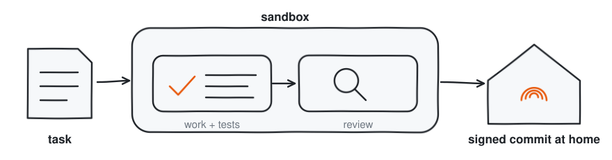

# fleet

One Mac runs many coding agents, each in its own sandbox, and their finished branches come home signed with the owner's fingerprint.

<picture>
  <source media="(prefers-color-scheme: dark)" srcset="docs/hero-dark.svg">
  
</picture>


## Quickstart

Requirements: macOS 14+ on Apple Silicon, Homebrew, Node 22.19+, a Docker account, a GitHub token, and both [pi](https://www.npmjs.com/package/@earendil-works/pi-coding-agent) and Claude Code.

```bash
git clone https://github.com/jaqubowsky/fleet.git ~/harness
cd ~/harness
```

Then start your agent there and tell it: **"read SETUP.md and set me up"**. [SETUP.md](SETUP.md) is written for the agent: it checks each requirement, runs each step with a check that proves it landed, and tells you what only you can do (logins, tokens, the fingerprint).

## How it works

You talk to one agent on your Mac. It hands each task to a fresh sandbox, where another agent does the work, tests it and has it reviewed. When the work is done, it comes back to your Mac, and only there does it get signed and pushed.

<picture>
  <source media="(prefers-color-scheme: dark)" srcset="docs/task-dark.svg">
  
</picture>

Under the hood the sandbox is a [Docker Sandbox](https://docs.docker.com/ai/sandboxes/install/) (`sbx`) holding a private clone of the repository, and the agent runs in a [herdr](https://github.com/herdrdev/herdr) tab. The host and the sandbox share a task directory: the sandbox writes its analysis, tickets, review and `status.md` there, and the host wakes each time the sandbox's agent settles.

Every command the agent on your Mac wants to run passes a guard first. Ordinary work goes through; the few things that could hurt you, like rewriting history on GitHub or reading your keys, are stopped before they run.

<picture>
  <source media="(prefers-color-scheme: dark)" srcset="docs/guard-dark.svg">
  
</picture>

The same policy runs in pi's extension and in Claude Code's `PreToolUse` hook, so both agents live by one rule set.

The sandboxes never hold your keys. They have no SSH key, no signing key and no secrets; a proxy on your Mac adds credentials to their requests, and the fingerprint that signs every commit stays on the Mac.

<picture>
  <source media="(prefers-color-scheme: dark)" srcset="docs/trust-dark.svg">
  
</picture>

Everything is written once and rendered for each agent: rules, skills, sub-agents, the guard and the `fleet` CLI. Your own values, such as which repositories you work on and what each agent may do there, live outside the repository in `~/.config/harness/`.

## Commands

| Command | What it does |
| --- | --- |
| `fleet up <label> --repo <path>` | starts a new sandbox for a task and opens its agent in a tab |
| `fleet steer <sandbox> <text>` | tells the sandbox's agent something |
| `fleet watch` | reports each time a sandbox's agent finishes a step |
| `fleet peek <sandbox>` | shows the sandbox's branch, changes and screen |
| `fleet land <sandbox> --push` | brings the branch home, signs it with your fingerprint and pushes it |
| `fleet down <sandbox>` | removes the sandbox and keeps its notes |

`fleet --help` lists the rest: `ls`, `build`, `render`, `profile`, `handoff`, `history`, `artifacts`, `exec`, `copy`, `init`.

## The guard

What the guard stops on your Mac, one real case each from its test corpus:

| Blocked | Example |
| --- | --- |
| Rewriting history on GitHub | `git push -fu origin main` |
| Reading keys and secrets | `cat ~/.ssh/id_ed25519` |
| Reading the agents' credential stores | `cat ~/.pi/agent/auth.json` |
| Writing its own config | `Edit ~/.claude/settings.json` |
| Changing what agents are allowed to do | `Edit host/repos.json` |
| Turning commit signing off | `git config --global commit.gpgsign false` |
| Pull requests against someone else's repository | `gh pr create --repo someone/else --fill` |
| Publishing files as gists | `gh gist create notes.md` |
| Deleting your work | `rm -rf /Users/alice/Work` |

`host/tests/` holds 424 cases the guard must allow or refuse, and `npm test` runs every one of them through the policy, and the home-write cases through both agents' hooks. Landing, signing and removing a sandbox ask you first, as the repository's permission profile says.

## Trust model

Every signature comes from your Mac. Sandboxes get no SSH agent and no signing key, commit unsigned on their own branch, and reach GitHub and the model providers only through the sbx proxy, which holds the tokens on the Mac. `fleet land` checks every repository before any branch moves, re-signs only the commits GitHub lacks, and pushes fast-forward only. Force, delete and mirror pushes and turning signing off stay your own commands.

The limits, plainly:

- The guard matches patterns, not shell semantics: `eval` and variable indirection get past it. It stops mistakes and simple malicious code, not someone who has read the rule.
- The Claude guard is a user-level hook in `~/.claude/settings.json`. A repository's own `.claude/settings.json` can set `disableAllHooks` and turn it off, so open untrusted repositories in a sandbox, not in the host session.
- Every sandbox a profile covers receives that profile's GitHub token. The default hands every sandbox the host session's `GH_TOKEN`, so scope that token to the repositories you work on.
- Sandboxes run with `CI=true`: test runners run once instead of watching, and snapshots fail instead of updating.

## This is my setup, fork it

fleet is how I work, published as it runs on my Mac: opinionated, not plug-and-play, and it needs both pi and Claude Code. Take the ideas, or fork it and let your own agent adapt it through [SETUP.md](SETUP.md).

Credits: the code smell list the reviewer works from is adapted from [mattpocock/skills](https://github.com/mattpocock/skills), MIT; see [THIRD_PARTY_NOTICES.md](THIRD_PARTY_NOTICES.md).

License: [MIT](LICENSE).

## Reference

<details>
<summary>Numbers</summary>

369 commits over two weeks, 16 to 30 September 2026; 7.8k lines of TypeScript in `src/`, 13.6k lines of tests; 424 guard cases; 19 skills written once for both agents.

</details>

<details>
<summary>Permission profiles</summary>

What each seat may do in a repository is its profile: `~/.config/harness/repos.json`, matched by `owner/repo`, then `owner/*`, then the `*` of `host/repos.json`. Agents read profiles and the guard refuses them any write to one. `fleet profile <repo>` prints the one that applies.

| Field | Seat | Levels | What it governs |
| --- | --- | --- | --- |
| `sign` | host | `none`, `human`, `auto` | whether `land` signs the commits origin lacks; `human` is one Touch ID tap per commit |
| `push` | host, container | `none`, `human`, `auto` | who pushes the branch; a container at `auto` pushes its own branch with a token that sees no other private repository |
| `pr` | host, container | `none`, `human`, `auto` | who opens the pull request |
| `merge` | host | `none`, `human`, `auto` | whether the host merges; containers never merge |
| `down` | host | `none`, `human`, `auto` | whether the host removes a container on its own |
| `linear` | host, container | `none`, `read`, `write` | access to the Linear server the profile names |
| `token` | container | `env:<NAME>`, `op://…` | the GitHub token bound into the container, from the host session's environment or 1Password |
| `resources` | container | memory, cpus | the sandbox's size |

`none` never, `human` after the person confirms, `auto` without asking. A host that signs at `human` cannot go with a container that pushes at `auto`: unsigned commits would reach GitHub first. The default `*` profile lets the container open pull requests and leaves signing, pushing and removing containers to the person.

</details>

<details>
<summary>Repository layout</summary>

| Path | What |
| --- | --- |
| `rules/` | global rules; `{{token}}` marks the words that differ per harness |
| `rules/refs/` | what rules and skills point to: the task directory contract, testing, reading CI, the ticket template |
| `templates/project/` | the seed `init` lays into a new project: `AGENTS.md` and `spec/vision.md` |
| `skills/` | `shared/` renders into both seats, `host/` into the host seat, `container/` into the image |
| `agents/` | read-only sub-agents `explorer`, `researcher`, `reviewer`; each harness adds their frontmatter as `fragments/agent-<name>.md` |
| `fragments/` | text a harness can replace with its own `<harness>/fragments/<name>.md` |
| `src/harness.ts` | every value that differs per harness: the seat, the host session running `fleet`, and the kind, the agent a container runs |
| `src/render/` | renders rules, skills, agents and settings for one harness and seat |
| `src/fleet/` | the fleet CLI behind `fleet` |
| `src/guard/` | the tool-call policy both hosts enforce, tested against the case corpus in `host/tests/` |
| `src/remote/` | the pi phone remote, see `extensions/pi-remote/README.md` |
| `src/statusline/` | the status line pi and Claude draw: folder, branch, model, context bar toward the 250k handoff, usage limits |
| `extensions/` | pi extensions: fleet monitor, guard, session handoff, error handoff, status history, state relay, statusline, phone remote |
| `sbx/` | `build.sh`, the container rule `sandbox.md`, `base-worktree`, `ticket-check` and `toolchain.Dockerfile`, which every `<harness>/sbx/Dockerfile` pulls in at `{{toolchain}}` |
| `host/` | herdr config and pi screen rules, the no-ssh-agent kit, the guard corpus and test runner |
| `host/repos.json` | the `*` profile, the one a repository your own profiles omit gets |
| `host/projects/template.md` | the headings of a per-repository overlay |
| `pi/`, `claude/` | per-harness profiles, model seats, themes, host extension entry or hooks, kit, image; `claude/profiles/host.json` is the Claude host's settings |
| `docs/` | the diagrams in this README |
| `bin/` | `fleet`, the one CLI both hosts run |
| `sync.sh` | brings every home, link, image and setting in line with this repository; prints the plan, `--apply` makes it; ends with what a new Mac lacks that it cannot set up, under `== set up by hand` |
| `SETUP.md` | setting a Mac up from a fresh clone, written for an agent: tokens, model logins, network policy |

The homes hold only rendered files and runtime state. Edit here and run `./sync.sh --apply`, never edit a home. Render replaces the directories listed in `OWNED` in `src/render/render.ts` whole, so a file removed here disappears there too.

</details>

<details>
<summary>pi and Claude Code side by side</summary>

| Concern | pi | Claude Code | Why |
| --- | --- | --- | --- |
| Waking the host | `extensions/fleet-monitor.ts` runs `src/fleet/watch.ts` in process and triggers a turn per wake | `fleet watch` runs the same `watch.ts`, held with `Monitor` | Claude Code has no API for an extension to start a turn |
| Which containers wake it | the ones this session put up or steered, by `PI_SESSION_ID`; more with `/fleet-watch` | the ones this herdr pane put up or steered last; more by name on `fleet watch` | same as above |
| Agent state in herdr | `fleet relay` in the pane reports as `fleet:pi` | herdr reads Claude's screen | herdr's Claude integration reports only the session |
| Guard | extension, pi tool names translated | `PreToolUse` hook in `~/.claude/settings.json`, fails closed | where each agent lets code intercept a tool call |
| Session handoff | suggested in `status.md` at natural breaks; a `turn_end` note at 250k tokens and every 100k after; `/session-handoff` opens the fresh session | same suggestion; a `PostToolUse` hook at the same thresholds; `/clear` from the user or host, recorded by a `SessionStart` hook | Claude Code cannot replace a session from inside it |
| Error handoff | `agent_end` with `stopReason: error` | `StopFailure` hook | each agent's own error event |
| Status history into `logs/status.jsonl` | `tool_execution_end` | `PostToolUse`, `Stop` and `StopFailure` hooks | each agent's own after-tool event |
| Transcripts in `logs/sessions/` | written as they happen | copied out by `fleet down` | Claude Code has no session directory setting |
| Activity in `logs/activity.jsonl`, cost so far in wakes and `ls` | `tool_execution_end`; cost from `logs/sessions` | `PostToolUse` and `PostToolUseFailure` hooks; cost from `src/fleet/usage.ts` run in the container over its transcripts | Claude transcripts stay in the container until `fleet down` |
| Cost in `logs/usage.json` | the session's own cost records | computed from tokens with the price table in `src/fleet/usage.ts` | Claude transcripts carry tokens, not cost |
| Statusline | `extensions/statusline.ts` with `src/statusline/` | `claude/statusline.mjs` with `src/statusline/` | Claude Code runs a command |
| Models | seats in `pi/profiles/models.json` | seats in `claude/profiles/models.json`, `effort` per agent | `CLAUDE_CODE_SUBAGENT_MODEL` stays unset, see `SETUP.md` |
| Phone control | `extensions/pi-remote` | Remote Control, a product setting | Claude Code ships its own |
| Host sandbox | none | macOS sandbox from `claude/profiles/host.json` | only Claude Code has one |

</details>

<details>
<summary>Checks</summary>

```bash
npm test          # node --test over src/, the guard corpus, skills load, extension checks, the settings aligner
npm run check     # tsc --noEmit
```

</details>
