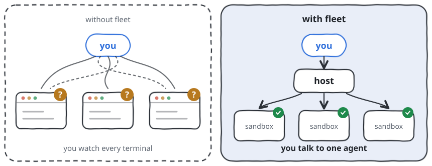
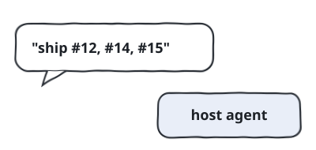
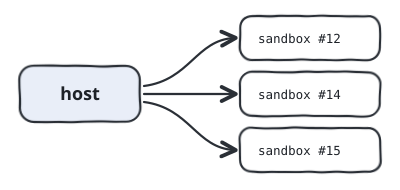
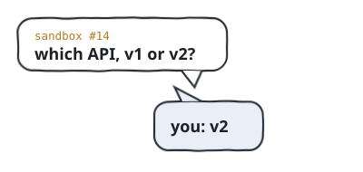
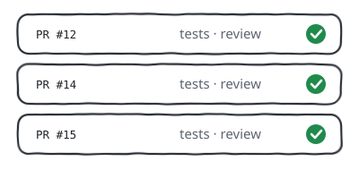
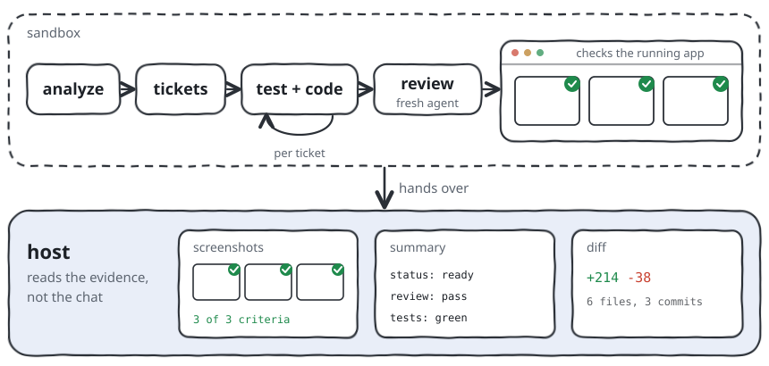
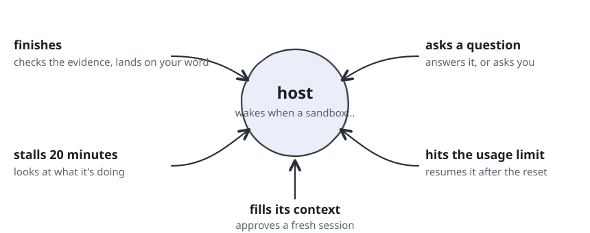
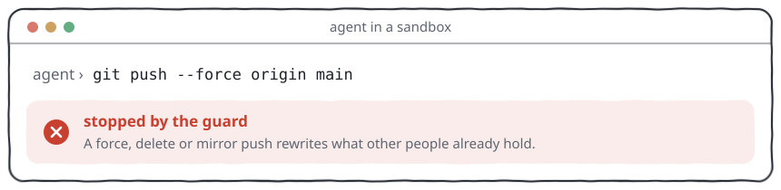

# fleet

Give your coding agent a list of issues and get pull requests back. fleet runs each issue in its own sandbox with its own agent, all at once, and asks you only when a decision is yours.

You only talk to one agent, the host, on your Mac. It starts a sandbox per issue, keeps an eye on all of them and checks the finished work before anything lands. Questions it can't answer come to you. Every command any agent runs passes a tested guard first.

<picture>
  <source media="(prefers-color-scheme: dark)" srcset="docs/before-after-dark.svg">
  
</picture>


## How it works

<table>
<tr>
<td width="50%" valign="top">
<h4><code>1</code> You say what to ship</h4>
<picture>
  <source media="(prefers-color-scheme: dark)" srcset="docs/step-1-dark.svg">
  
</picture>
<p>You talk to one agent on your Mac, the host. Say it in plain words, give it Linear issues, or hand it a markdown file.</p>
<pre><code>you › ship #12, #14, #15</code></pre>
</td>
<td width="50%" valign="top">
<h4><code>2</code> Each issue gets a sandbox</h4>
<picture>
  <source media="(prefers-color-scheme: dark)" srcset="docs/step-2-dark.svg">
  
</picture>
<p>Each sandbox is a private copy of the repo with its own agent. Sandboxes run side by side and can't touch each other or your checkout.</p>
<pre><code>fleet up web-12 --repo ~/code/app</code></pre>
</td>
</tr>
<tr>
<td width="50%" valign="top">
<h4><code>3</code> It asks only when it has to</h4>
<picture>
  <source media="(prefers-color-scheme: dark)" srcset="docs/step-3-dark.svg">
  
</picture>
<p>The agents answer whatever the code or the tracker can answer. Everything else reaches you as one short question.</p>
<pre><code>[fleet] claude-app-web-14: working -> blocked
attention: which API, v1 or v2?</code></pre>
</td>
<td width="50%" valign="top">
<h4><code>4</code> Pull requests come back</h4>
<picture>
  <source media="(prefers-color-scheme: dark)" srcset="docs/step-4-dark.svg">
  
</picture>
<p>Each one is tested and reviewed, and tried in the running app when it changes what users see. It lands when you say so, and the repository's profile decides who opens the pull request.</p>
<pre><code>fleet land claude-app-web-12 --push</code></pre>
</td>
</tr>
</table>

## Quickstart

You need a Mac with Apple Silicon, [Docker Sandboxes](https://docs.docker.com/ai/sandboxes/), [herdr](https://github.com/herdrdev/herdr), Node, Claude Code and pi.

```bash
git clone https://github.com/jaqubowsky/fleet ~/harness
cd ~/harness && claude
```

Then tell your agent: **"read SETUP.md and set me up"**. It checks what you have, asks what it can't know, and ends by starting and stopping one test sandbox.

<details>
<summary>Rather do it by hand?</summary>

```bash
brew trust docker/tap && brew install docker/tap/sbx herdr
npm install -g @earendil-works/pi-coding-agent
curl -fsSL https://claude.ai/install.sh | bash
git clone https://github.com/jaqubowsky/fleet ~/harness && cd ~/harness
mkdir -p ~/.config/harness/git   # put the sandboxes' .gitconfig here, SETUP.md step 3
./sync.sh            # prints what it would change
./sync.sh --apply
herdr integration install claude && herdr integration install pi
```

Sign in to sbx and Claude Code and install Claude's TypeScript LSP plugin before `--apply`, which builds the sandbox images. Logins, tokens and sandbox secrets are in `SETUP.md`.

</details>

## Inside one sandbox

Every sandbox agent follows the same run. It works out the task, cuts it into small tickets and builds each one test first, committing only after the checks pass.

Then a second agent reviews the change whenever it reaches beyond its own feature. It never saw the implementation, so it reads the diff the way a stranger would, for bugs and for code quality. When the change is something users see, the sandbox opens the running app in a real browser and takes one screenshot per acceptance criterion. It records a video walkthrough when you ask for one.

Once the pull request is open, tell the sandbox to babysit it. It answers review comments and fixes red checks, round after round.

<picture>
  <source media="(prefers-color-scheme: dark)" srcset="docs/sandbox-to-host-dark.svg">
  
</picture>

## You don't watch terminals

The host sleeps until a sandbox needs something, then wakes up with what changed.

<picture>
  <source media="(prefers-color-scheme: dark)" srcset="docs/host-watch-dark.svg">
  
</picture>

## Every command passes a guard

Every tool call an agent makes goes through a policy first. This is what an agent gets back when it tries to rewrite history:

<picture>
  <source media="(prefers-color-scheme: dark)" srcset="docs/guard-refusal-dark.svg">
  
</picture>

| Stopped | Example |
| --- | --- |
| Rewriting shared history | `git push --force`, delete and mirror pushes |
| Reading secrets | SSH keys, the keychain, `op read` |
| Changing its own rules | writes to `~/.claude` and `~/.pi` |
| Deleting your work | `rm -rf` on home and project folders |
| Acting on GitHub for you | merging a PR in another repository |

## Commands

| Command | What it does |
| --- | --- |
| `fleet up <label> --repo <path>` | starts a sandbox for a task, its agent waiting in a tab |
| `fleet steer <sandbox> "<text>"` | sends that agent its next instruction |
| `fleet watch` | wakes the host when a sandbox needs it |
| `fleet peek <sandbox>` | shows what it is doing right now |
| `fleet land <sandbox> [--push]` | brings the finished branch home, and pushes it with `--push` |
| `fleet down <sandbox>` | closes the sandbox; its notes and logs stay |

`fleet --help` lists every verb and flag.

## Also in the box

- **Several repositories in one task.** Repeat `--repo`, and one `land` brings all of them home.
- **Permissions per repository.** `fleet profile` shows who may push, open and merge pull requests, for the host and for the sandbox.
- **Cost per task.** `fleet ls` shows what each sandbox has spent so far.
- **A record of every task.** Plan, review and logs stay in a task folder after the sandbox is gone, and `fleet history` replays how its status changed.
- **A setup that audits itself.** `audit-harness` reads past transcripts and reports what held, what broke and what's missing, quoting each.
- **Your phone as a remote.** Drive pi sessions from your phone over Tailscale.

## Trust model

Sandboxes never hold your SSH or signing key, and their GitHub token reaches them only through the sandbox proxy. A repository's ignored `.env` files are copied into its sandbox. Three things never happen without you:

- a force, delete or mirror push, from any seat;
- a pull request opened or merged where the repository's profile doesn't give the host `auto`, since the guard refuses it;
- a push or a signature with your key, since the key waits for your Touch ID on the Mac.

The guard matches patterns and doesn't understand the shell, so `eval` gets past it. A repository's own `.claude/settings.json` can also switch off user hooks. It stops mistakes. Someone who has read the rules can get around it.

## Make it yours

Rules, skills and the guard are written once in this repo and rendered for both Claude Code and pi. To add a skill, drop a `SKILL.md` into `skills/shared`, `skills/host` or `skills/container` and run sync. It reaches both agents, on your Mac, in the sandboxes or both. Edit or delete the bundled skills the same way. Keep them in the repo, because sync replaces `~/.claude/skills` on every run.

## This is my setup

> It is opinionated and built around how I work. Fork it and let your agent bend it to yours.

Code smells list adapted from [mattpocock/skills](https://github.com/mattpocock/skills) (MIT). Licensed [MIT](LICENSE).
